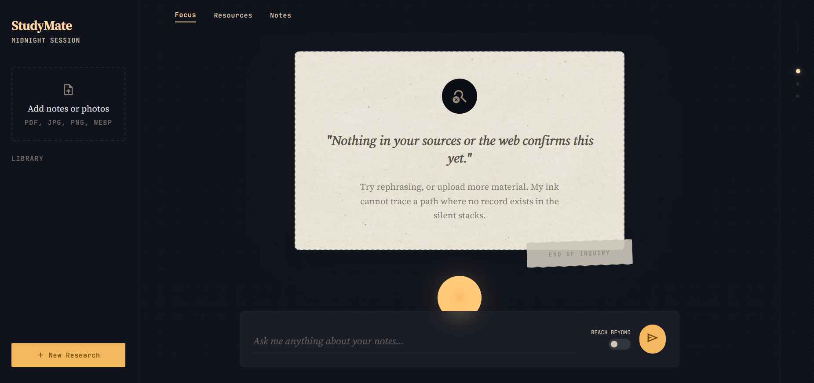

# StudyMate — Hybrid AI Study Companion

StudyMate turns scattered study material — PDF lecture notes, photos of handwritten or
whiteboard notes, and live web sources — into a single place you can ask questions and
get grounded answers back.

Every answer traces back to a real source: a page in one of your PDFs, a photo you
uploaded, or a live web result. If it can't find a real source for something, it says
so instead of guessing.

**Live app:** https://dvstudymate.netlify.app
**Backend API:** https://studymate-l8bp.onrender.com *(free-tier — the first request after a
period of inactivity can take 20–30s to wake it up)*



## How it works

1. **Upload** a PDF or a photo of your notes. StudyMate extracts the text (and, for
   images, describes/reads the content), splits it into chunks, and indexes it.
2. **Ask a question.** StudyMate retrieves the most relevant chunks from what you've
   uploaded and, if you turn on "Reach Beyond," also pulls in live web results.
3. **Get a grounded answer.** The model answers using only what it retrieved, and every
   claim is attached to a citation — a page number, an image thumbnail, or a source URL.
4. **Check the sources.** Click any citation badge to flip it over and see the exact
   excerpt the answer was based on.
5. **No source, no answer.** If nothing in your documents or the web actually supports
   an answer, StudyMate tells you it doesn't know rather than making something up.

## Using it

- **Upload documents** from the sidebar (desktop) or the document strip (mobile) — drag
  and drop or click to pick a file. Supported: `.pdf`, `.png`, `.jpg`, `.jpeg`, `.webp`,
  `.gif`.
- **Ask questions** in the input bar. Toggle "Reach Beyond" if you want the answer to
  also draw on live web search, not just your uploaded documents.
- **Read the reasoning trace** under an answer to see which sources were checked.
- **Open the Resources tab** to see every document you've uploaded plus any web sources
  pulled into recent answers.
- **Use Notes** for your own session-scoped notes — these stay local to your session and
  are never sent to the model or indexed for retrieval.

## Architecture

```
frontend/   React + Vite + Tailwind — chat UI, citation badges, reasoning trace,
            document upload. Deployed on Netlify.
backend/    FastAPI + ChromaDB + Gemini 2.5 Flash — ingestion, RAG retrieval,
            multimodal reasoning, structured citation output. Deployed on Render.
```

**Stack**
- **LLM**: Gemini 2.5 Flash (multimodal — text + vision + function calling)
- **Embeddings**: Gemini `text-embedding-004`
- **Vector store**: ChromaDB (self-hosted, persistent mode)
- **Web search grounding**: Tavily API
- **PDF parsing**: PyMuPDF (preserves page numbers for citation)
- **Backend**: FastAPI + Pydantic (structured JSON output enforces the citation schema)
- **Frontend**: React + Vite + Tailwind

All tools used are free-tier, no card required — see `backend/README.md` for API key
setup.

## Running it locally

### Backend
```bash
cd backend
python -m venv venv
source venv/bin/activate      # Windows: venv\Scripts\activate
pip install -r requirements.txt
cp .env.example .env          # add your GEMINI_API_KEY and TAVILY_API_KEY
uvicorn main:app --reload
```
Runs at `http://localhost:8000`. See `backend/README.md` for where to get free API keys
and full endpoint docs.

### Frontend
```bash
cd frontend
npm install
cp .env.example .env.local    # set VITE_API_URL=http://localhost:8000
npm run dev
```
Open the printed local URL. Without `VITE_API_URL` set, the app shows a real error
state rather than a mock answer — there is no demo/fallback mode.

## API contract

`POST /query` returns:

```json
{
  "answer": ["paragraph 1", "paragraph 2"],
  "citations": [
    { "type": "pdf", "label": "Lecture Notes.pdf", "meta": "PAGE 12", "excerpt": "..." },
    { "type": "image", "label": "whiteboard.jpg", "meta": "DIAGRAM", "thumbnail": "url" },
    { "type": "web", "label": "en.wikipedia.org", "meta": "LIVE SOURCE", "excerpt": "..." }
  ],
  "reasoningSteps": [
    { "label": "INTERNAL REPOSITORY", "text": "Checked Lecture Notes.pdf" }
  ],
  "insufficient": false
}
```

If `insufficient` is `true`, no citations could ground an answer and the frontend shows
a "couldn't find an answer" state instead. See `backend/README.md` for the full
`/upload` and `/query` reference.

## Contributors

- [Dhanya Mankad](https://github.com/dhanyamankad) — Frontend & UI (React/Tailwind)
- [Vanshi Davda](https://github.com/vanshidavda2537) — Backend & AI orchestration (FastAPI, RAG pipeline, web search grounding)
